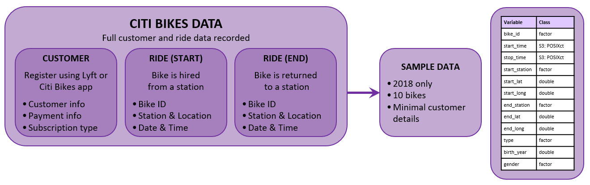
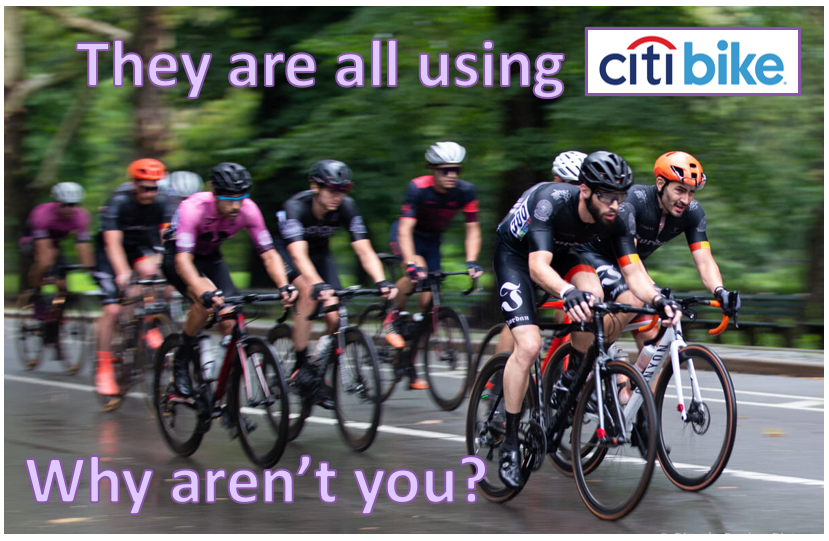
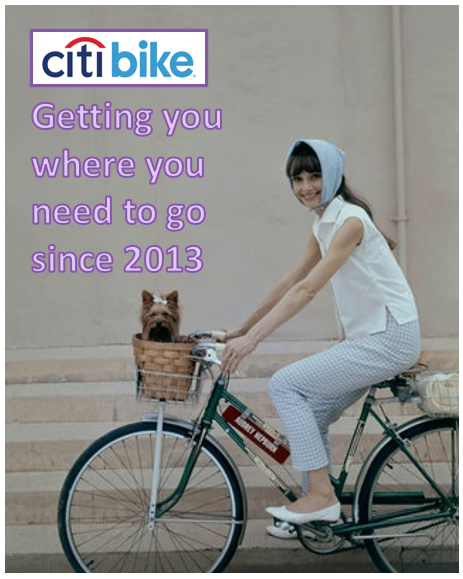
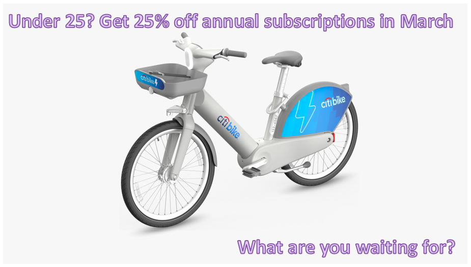

```{r setup, include=FALSE}
knitr::opts_chunk$set(echo = FALSE, fig.align = "center")
```
```{r message=FALSE, warning=FALSE, include=FALSE}
library(tidyverse)
library(tsibble)
library(tsibbledata)
library(infer)
library(leaflet)
```

# 1. Documentation
### Background and Research
Citi Bike started life as New York City’s bike share scheme. Launched in May 2013, it has grown in size over the last decade and now has 25,000 bikes and over 1,500 stations across Manhattan, Brooklyn, Queens and the Bronx as well as over the Hudson River in Jersey City and Hoboken. 

Customers register using the Citi Bike or Lyft app. They can unlock a bike at any station and then return it to any station at the end of their trip. There are a number of pricing schemes to fit a customers' usage. The bikes are intended to be used for short trips and so hires are limited to 30 or 45 minutes, though this can be extended for a fee.

The sample data shows usage of ten bikes based in Jersey City throughout 2018. The data includes event data on each bike hire, including the  start and end times and locations. Limited customer information (gender, birth year and subscription type) is also in the data.

Sources:  
https://ride.citibikenyc.com/about  
https://citibikenyc.com/how-it-works  
R Documentation nyc_bikes "NYC Citi Bike trips"

### Business Requirements
##### Bike Hire Patterns Over Time
Patterns of use will be analysed by considering bike hire in terms of:  

- time of day  
- day of the week  
- month  
- yearly trend  

A rolling 30 day average will be calculated to smooth the usage data.  
Hypothesis testing will help to test whether there is a significant difference in bike hires at weekends versus weekdays.  
<br>

##### Customer Demographics
We have limited customer information, but will consider:  

- customer gender  
- customer age  
- subscription type  
<br>

##### Geographical Spread of Start Points
The ten bikes in our data set are moved around Jersey City by customer use and by the Citi Bike team. By examining the geographical spread of the start points we will be able to identify areas that are most popular with customers. Identifying hot-spots can assist with stock-management and future investment.  
<br>

##### Other Insights
The time series and geospacial data allow us to examine:

- length of hire
- distance between start and end stations
<br>

### Data Flow
Customers register to hire a bike using the Citi Bike or Lyft app. It can be assumed that more customer information and payment details are held, but have not been shared in the data set. We have limited information about a customer: year of birth, gender (if given) and the type of subscription they hold. Alongside the fact that only ten bicycles are contained in the data set, this anonymises the customer sufficiently for any ethical concerns.  
  
Data is collected whenever a bike is unlocked from a docking station and returned. This allows us to establish the length of time the bike has been hired for, and how far from the start point it has ended up.  
<br>


### Business Insights
By examining data trends, we can discover instances of high demand, offering opportunities to allocate resources and marketing efforts to enhance sales. The same trends can pinpoint areas with growth potential, presenting opportunities for targeted marketing or requiring further investigation.  Identifying the busiest locations will help influence future investment, both in this city and in future schemes.  The KPI from the data given is the number of bike hires. If we were given more customer data, subscription renewals and revenue from day passes would be important too.
<br>

### Variables and Data Types
nyc_bikes has the following variables and data types (taken from R Documentation).

| Variable      | Data Type | Description |
| :------------ | :-------- | :---------- |
| bike_id       | factor    | Identification number of each bike |
| start_time    | POSIXct   | Time and date when the trip started |
| stop_time     | POSIXct   | Time and date when the trip ended |
| start_station | factor    | Identifier for the starting bike station |
| start_lat     | double    | Latitude of the starting bike station |
| start_long    | double    | Longitude of the starting bike station |
| end_station   | factor    | Identifier for the destination bike station |
| end_lat       | double    | Latitutde of the destination bike station |
| end_long      | double    | Longitude of the destination bike station |
| type          | factor    | Type of subscription |
| birth_year    | double    | Bike rider's year of birth |
| gender        | factor    | Gender of the bike rider |

Some of these columns were manipulated to extract time elements or to reveal other insights such as length of hire and distance between start station and destination station.  
<br>

### Data Quality and Bias
**Completeness**  
Data quality is good, with no missing information.  
**Small sample**  
Our subset is small - only ten bikes from a network that is now over 25,000. The time span is also only one year. Better inferences could be made from a larger sample over several years.  
**Customer Information**  
Most customer information appears reliable, but a small number have withheld gender or lied about age.  
**Bias**  
Our customer data unavoidably has a sampling bias towards people who want to hire a bike. A wider survey may capture reasons why people have not hired bikes which may give insights into broadening appeal and attracting new customers.  
The area for the data comes from a comparatively small, urban area in Jersey City. It may not be reflective of the rest of this bike scheme, other cities or similar schemes in other countries.  
<br>

# 2. Data Cleaning
The data was clean with very little tidying needed. There was no missing data, though on 269 journeys customers declined to give their gender.  
Two customers claimed to be around 130 years old and there was a strong prevalence for customers to have a birth year of '69 which is likely to be spurious in some cases. Other than that there was no reason to doubt the reliability of customer data and no changes were made.  
<br>
The data was wrangled to allow for easier analysis using time variables. The duration of each hire was calculated. The haversine formula was applied to find the distance between start and end stations.  
<br>
Some of the lengths of time that bikes were hired seem excessive considering that bikes are supposed to be borrowed for under one hour. This may be because customers failed to correctly dock the bike at the end point or didn't realise that keeping the bike for hours would be costly.
```{r message=FALSE, warning=FALSE}
hire_data <- nyc_bikes %>% 
  mutate(hour = hour(start_time),
         day = day(start_time),
         month = month(start_time, label = TRUE, abbr = TRUE),
         year = year(start_time),
         weekday = weekdays(start_time, abbr = TRUE),
         quarter = yearquarter(start_time, fiscal_start = 1),
         date = date(start_time),
         length_of_hire = stop_time - start_time,
         distance_km = round(
           geosphere::distHaversine(matrix(c(start_long, start_lat), ncol = 2),
                                    matrix(c(end_long, end_lat), ncol = 2),
                                    r = 6369.08), 3) # radius at NYC
  )

weekdays <- c("Mon", "Tue", "Wed", "Thu", "Fri", "Sat", "Sun")
```
<br>

# 3. Data Visualisation
### Bike Hire Patterns Over Time
Using simple plots, I first visualised the number of times bikes were hired at different times of day, on different days of the week, each month and each quarter. I made the graphs follow the same theme and maximised white space by removing unneccesary labels. Insights from these graphs directed further visualisation and analysis. Visualisations were made in RStudio using the ggplot package.
<br>
```{r}
time_plot <- hire_data %>% 
  index_by(hour) %>% 
  ggplot(aes(x = hour)) +
  geom_histogram(binwidth = 1, just = 0, colour = "white", fill = "#8856a7") +
  labs(x = "",
       y = "Number of Hires\n",
       title = "Time of Day") +
  theme_minimal(base_size = 12) +
  scale_x_continuous(breaks= seq(0, 24, 2), minor_breaks = NULL)

day_plot <- hire_data %>% 
  group_by(weekday) %>% 
  ggplot(aes(x = factor(weekday, levels = weekdays))) +
  geom_bar(colour = "white", fill = "#8856a7")+
  labs(x = "",
       y = "",
       title = "Day of the Week") +
  theme_minimal(base_size = 12)

month_plot <- hire_data %>% 
  group_by(month) %>% 
  ggplot(aes(x = month)) +
  geom_bar(colour = "white", fill = "#8856a7") +
  labs(x = "",
       y = "Number of Hires\n",
       title = "Month") +
  theme_minimal(base_size = 12) +
  scale_x_discrete(labels = c("J", "F", "M", "A", "M", "J", "J", "A", "S", "O", "N", "D"))

quarter_plot <- hire_data %>% 
  group_by(quarter) %>% 
  ggplot(aes(factor(x = quarter))) +
  geom_bar(colour = "white", fill = "#8856a7") +
  labs(x = "",
       y = "",
       title = "Quarter") +
  theme_minimal(base_size = 12)

gridExtra::grid.arrange(time_plot, day_plot, month_plot, quarter_plot, ncol = 2)
```
<br>
**Time of Day**  
There are is an obvious increase in the number of times the bikes were hired during peak commuting hours. It would be prudent for Citi Bikes to have maximum availability at these times, and perhaps to station more bikes at busier commuter locations.  
<br>
**Day of the week**  
Marginally fewer bikes were hired at the weekend. Further analysis of daily trends will follow.  
<br>
**Month and Quarters**  
The number of times the bikes were used each month, or quarter, indicate a periodic increase during spring and summer months, before dipping back down in fall and winter. Data from more years should be analysed to confirm this trend. If the company could find a way to encourage bike use in the winter months, perhaps by offering incentives or through advertising campaigns, there is a capacity for growth. Making more bikes available in summer months would increase revenue due to an increase in demand.  
<br>
```{r}
hire_data %>% 
  index_by(date) %>% 
  summarise(hires = n()) %>% 
  mutate(
    hires_moving_average = slider::slide_dbl(
      .x = hires, 
      .f = ~mean(.x, na.rm = TRUE), 
      .before = 14,
      .after = 15,
  )) %>% 
  ggplot() +
  geom_line(aes(x = date, y = hires), linewidth = 0.6, colour = "grey", alpha = 0.8) +
  geom_line(aes(x = date, y = hires_moving_average), linewidth = 1, colour = "#8856a7") +
  labs(x = "",
       y = "Number of Hires",
       title = "Hires per day with rolling 30 day average") +
  theme_minimal()
```
<br>
This time plot confirms the increase during the spring and summer months of 2018. Again, we can identify scope for increasing hires during winter months and maximising summer revenue.  
<br>
```{r}
hire_data %>% 
  index_by(hour) %>% 
  ggplot(aes(x = hour)) +
  geom_histogram(binwidth = 2, just = 0, colour = "white", fill = "#8856a7") +
   labs(x = "Time of Day",
       y = "Number of Hires",
       title = "Patterns of Daily Use") +
  theme_minimal(base_size = 12) +
  scale_x_continuous(breaks= seq(0, 24, 6), minor_breaks = NULL) +
  facet_grid(~ factor(weekday, levels = weekdays))
```
<br>
These plots demonstrate a clear difference in bike demand on weekdays, versus the weekend. On weekdays, there is high demand during commuting hours. Locating bikes in high-traffic areas at these times could increase revenue. On weekends, the usage is more spread through the middle of the day. There may be scope to increase leisure use on weekends, perhaps encouraged by targeted advertising at key demographics.

**Fewer Bikes Hired at Weekends**  
A hypothesis test was carried out to investigate the statement *"There is no significant reduction in the number of bikes hired on a Saturday or Sunday"*. The result of this test was a rejection of this statement. Hence, there are significantly fewer bikes hired on Saturday and Sunday. This further supports the suggestion that there is capacity to increase bike use at weekends.

<details>
<summary>**Details of Hypothesis Test**</summary>
H~0~: There is no significant reduction in the number of bikes hired on a Saturday or Sunday.  
H~1~: Significantly fewer bikes are hired on Saturday and Sunday.  
<br>
Set alpha = 0.05  
```{r message=FALSE, warning=FALSE}
weekend_hire <- hire_data %>%
  index_by(date) %>% 
  summarise(number_of_hires = n()) %>% 
  fill_gaps(number_of_hires = 0) %>% 
  mutate(weekend = case_when(weekdays(date, abbr = TRUE) == "Sat" ~ "yes",
                             weekdays(date, abbr = TRUE) == "Sun" ~ "yes",
                             .default = "no"))

# observed_diff_in_mean is the average fewer hires on a weekend day
observed_diff_in_mean <- weekend_hire %>% 
  specify(number_of_hires ~ weekend) %>% 
  calculate(stat = "diff in means", order = c("yes", "no"))

# null distribution, assuming independence between weekend and hires
null_distribution <- weekend_hire %>%
  specify(response = number_of_hires, explanatory = weekend) %>% 
  hypothesise(null = "independence") %>%
  generate(reps = 500, type = "permute") %>% 
  calculate(stat = "diff in means", order = c("yes", "no"))

# visualisation
null_distribution %>% 
  visualise(bins = 30) +
  shade_p_value(obs_stat = observed_diff_in_mean, direction = "left", color = "#8856a7", fill = "#8856a7") +
  labs(x = "Difference in Mean Hires",
       y = "") +
  scale_y_continuous(labels = NULL) +
  theme_minimal(base_size = 12)

# p-value
str_c("P-Value = ", get_p_value(null_distribution, obs_stat = observed_diff_in_mean, direction = "left"), " which is less than 0.05 leading us to reject the null-hypothesis.")
```
</details>
<br>
<br>

**Summary of Key Points**

1. On weekdays there are two peaks in demand for bikes, during peak commuting hours in the morning and evening. It would be prudent to have maximum availability at these times, and to station more bikes at busier commuter locations.
2. Significantly fewer bikes are hired on Saturday and Sunday. There may be scope to increase leisure use on weekends, perhaps encouraged by targeted advertising at key demographics. Team up with a tour company to offer bicycle tours of the city.
3. Encourage bike use in winter months, perhaps by offering incentives or through advertising campaigns. There is capacity for growth.
4. Maximise revenue in summer months by making more bikes available, especially at peak times.
<br><br>


### Customer Demographics
Bar graphs help us to see any difering trends due to gender, subscription type and age. By analysing these demographics it is possible to identify areas of possible growth.  
<br>
**Gender**
```{r}
hire_data %>% 
  group_by(month) %>% 
  ggplot(aes(x = month, fill = gender)) +
  geom_bar(colour = "#8856a7") +
  labs(x = "",
       y = "Number of Hires",
       title = "Customer Gender by Month") +
  theme_minimal(base_size = 12) + 
  scale_fill_brewer(palette = "BuPu")
```
Around three times more men than women are responsible for journeys on the bikes. There is clear scope for growth amongst female customers and advertising and incentives should be targeted at this demographic. At the same time, cycling is obviously already popular amongst male citizens and this could be capitalised upon.  
<br>
**Type of customer**
```{r}
hire_data %>% 
  group_by(month) %>% 
  ggplot(aes(x = month, fill = type)) +
  geom_bar(colour = "#8856a7") +
  labs(x = "",
       y = "Number of Hires",
       title = "Customer Type by Month",
       fill = NULL) +
  theme_minimal(base_size = 12) + 
  scale_fill_manual(values = c("#9ebcda", "#8856a7"), labels = c("Casual", "Subscription"))
```
<br>
A "casual" customer has purchased a 24-hour or 3-day pass. A "subscription" is for a full year.  The vast majority of bikes are hired by customers with a subscription. This is indicative of the subscription model working well for customers. Additional revenue could be generated by increasing annual subscription cost or by encouraging more casual hire, perhaps by targeting visitors to the city.  
<br>
**Age of Customers**
```{r warning=FALSE}
hire_data %>% 
  index_by(birth_year) %>% 
  summarise(number_of_hires = n()) %>% 
  ggplot(aes(x = birth_year, y = number_of_hires)) +
  geom_col(colour = "white", fill = "#8856a7") +
  labs(x = "Year of Birth",
       y = "Number of Hires",
       title = "Age Demographic") +
  theme_minimal(base_size = 12) +
  scale_x_continuous(breaks = seq(1950, 2000, 10), limits = c(1948, 2002))
```
<br>
Assuming that the peak at 1969 is spurious, caused by people entering a fake year of birth, the peak customer age range is 26 to 32 years old (those born 1986 to 1992). There is scope for attracting more customers under the age of 25 and this could be achieved by offering a discounted subscription fee. There is the additional benefit that customers in this age bracket are likely to continue to subscribe for longer.

**Summary of Key Points**

1. Most bikes are hired by men. While trying to continue to grow this demographic, there is scope for promoting bikes to women. Effective marketing targeting this key demographic is needed. 
2. The subscription model is working well but visitors could be targetted with hourly, 1-day or 3-day passes.
3. Offer a discounted subscription to under-25s to attract long term customers from that demographic.

| Target Men         | Target Women        | Target Youth        |
|:------------------:|:-------------------:|:-------------------:|
| |  |  |


### Geographical Spread of Start Points
```{r message=FALSE, warning=FALSE}
as.tibble(hire_data) %>% 
  group_by(start_lat, start_long) %>% 
  summarise(number_of_hires = n()) %>% 
  leaflet() %>% 
  addTiles() %>% 
  addCircleMarkers(lng = ~start_long, lat = ~start_lat,
                   radius = ~number_of_hires/30,
                   label = ~number_of_hires,
                   color = "blue")
```
All 52 start locations for the bikes in the data set are in Jersey City.  
We can see some bike stations are far busier than others. Given that we already know that there is a peak demand between 07:00 and 9:00 and again between 17:00 and 19:00, which stations are busiest in the morning and which are busiest in late afternoon?

```{r message=FALSE, warning=FALSE}
busy_in_morning_rush <- as.tibble(hire_data) %>% 
  filter(hour == 7 | hour == 8) %>% 
  group_by(start_station, start_long, start_lat) %>% 
  summarise(number_of_hires = n()) %>%
  ungroup() %>% 
  filter(number_of_hires > 25) %>%  
  arrange(desc(number_of_hires))
         
busy_in_afternoon_rush <- as.tibble(hire_data) %>% 
  filter(hour == 17 | hour == 18) %>% 
  group_by(start_station, start_long, start_lat) %>% 
  summarise(number_of_hires = n()) %>% 
  ungroup() %>% 
  filter(number_of_hires > 25) %>% 
  arrange(desc(number_of_hires))

leaflet() %>% 
  addTiles() %>% 
    addCircleMarkers(data = busy_in_morning_rush,
                   lng = ~start_long, lat = ~start_lat,
                   radius = ~number_of_hires/5,
                   label = ~number_of_hires,
                   color = "blue") %>% 
    addCircleMarkers(data = busy_in_afternoon_rush,
                   lng = ~start_long, lat = ~start_lat,
                   radius = ~number_of_hires/5,
                   label = ~number_of_hires,
                   color = "red")
```
Bike stations marked with a blue dot are busy during the morning rush (7 - 9am).  
Bike stations marked with a red dot are busy during the afternoon rush (5 - 7pm).  
For the efficiency of the network, these stations should be stocked with bikes at the relevant times.  
The busiest stations are mostly close to other public transport hubs.
<br>

**Summary of Key Points**

1. The data can be used to identify busy stations at particular times of day. This enables some *stock management* that will improve customer experience.
2. Many of the busiest bike stations are near to other public transport hubs. This should be taken into account when expanding the network.  
<br>

### Length of Hire and Distance Between Stations
In order to gain an insight into the distribution of lengths of time that bikes were borrowed for, a five-figure summary and box plot can be obtained. The median is the most appropriate average due to extreme outliers in the data.
```{r message=FALSE, warning=FALSE, eval=FALSE}
as.tibble(hire_data) %>% 
  select(length_of_hire) %>% 
  mutate(length_of_hire = as.numeric(length_of_hire)) %>% 
  reframe(five_fig_summary = quantile(length_of_hire, probs = seq(0, 1, 0.25)))
```
```{r fig.height = 3}
hire_data %>% 
  ggplot() +
  geom_boxplot(aes(x = length_of_hire), fill = "#8856a7", 
               outlier.colour = "#8856a7", outlier.alpha = 0.3, width = 0.1) +
  scale_x_continuous(breaks = seq(0, 90, 10)) +
  coord_cartesian(xlim = c(0, 90)) +
  scale_y_continuous(labels = NULL, limits = c(-0.3, 0.3)) +
  labs(x = "Time (minutes)",
       y = "",
       title = "Length of Bike Hires") +
  theme_minimal()
```
Over 75% of hires lasted under 10 minutes.  Every hire longer than around 18.5 minutes is considered an outlier. Note that 32 outliers are not included on the plot as their times are greater than 60 minutes.  
<br>

```{r fig.height = 3}
hire_data %>% 
  ggplot() +
  geom_boxplot(aes(x = length_of_hire, fill = factor(type, levels = c("Customer", "Subscriber"))), 
              outlier.alpha = 0.3, width = 0.2) +
  scale_x_continuous(breaks = seq(0, 90, 10)) +
  coord_cartesian(xlim = c(0, 90)) +
  scale_y_continuous(labels = NULL, limits = c(-0.3, 0.3)) +
  labs(x = "Time (minutes)",
       y = "",
       title = "Length of Bike Hires by Subscription Type",
       fill = "") +
  theme_minimal() +
  scale_fill_manual(values = c("#9ebcda", "#8856a7"), labels = c("Casual", "Subscription")) +
  guides(fill = guide_legend(reverse = TRUE))
```
When we separate the length of hires by the subscription types we see that subscribers are most likely to take very short trips. Casual users (those with 1-hour or 3-day passes) are more likely to take longer with over a quarter of users exceeding the standard 30-minute ride time.  
<br>
```{r}
hire_data %>% 
  mutate(type_of_trip = case_when(distance_km == 0 ~ "Zero",
                                  distance_km < 1 ~ "Less than 1 km",
                                  distance_km < 2 ~ "1 km to 2 km",
                                  .default = "Over 2 km")) %>% 
  group_by(type_of_trip) %>% 
  ggplot(aes(x = factor(type_of_trip, levels = c("Zero", "Less than 1 km", "1 km to 2 km", "Over 2 km")))) +
  geom_bar(fill = "#8856a7") +
  labs(x = "",
       y = "Number of Hires",
       title = "Distances Between Start and End Stations") +
  theme_minimal(base_size = 12)
```
Over half of trips on the bikes end after less than 1 km, suggesting that customers are using the bikes to cover short distances more quickly than they would be able to on foot in the city.
<br>

**Summary of Key Points**

1. On average, trips are quite short, both in terms of time and distance.
2. Casual users tend to take longer on their trips. Increasing the allowed ride time may increase sales in this area.
<br>

# Overall Recommendations
1. Improve bike network efficiency by identifying the busiest stations, which are often close to public transport hubs; a larger sample will be useful for this. Maximise bike stock in these locations during peak commuting times.
2. Increase casual sales by promoting leisure use at weekends and increasing time limits on hires. Team up with a tour company to offer e-bike tours of the city using Citi Bikes.
3. Increase sales of subscriptions in the female and under-25 demographics. Use targeted advertising campaigns, discounts and incentives. 
